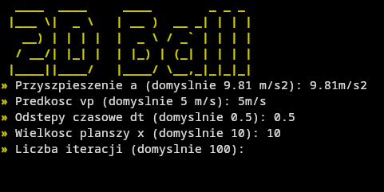
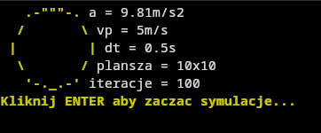
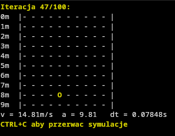

# Kulka 2D™ 

  

**czyli kulka spada, odbija się, i tyle**  

> _"Napisane w C++, bo życie nie może być za proste."_  
> – ktoś, kto nigdy nie używał `std::vector` i uznał `new int*[n]` za świetny pomysł
---
### Start menu:

### Parametry przed startem:

### Symulacja kulki:

## O CO TU CHODZI

To jest *symulator*. Ale nie taki, co ma grafikę, fizykę, RTXy i silnik dźwięku.  
To jest **terminalowy pogromca kart graficznych**.  
Tak szybki, że sprawia, iż twoja kula **napierdziela przez planszę w 0.049 sekundy** jak Goku na Red Bullu.

---

## UWAGA:
- Działa na Linuksie. I tylko na Linuksie. Bo Windows by się zagotował.

---

## DLACZEGO TO POWSTAŁO?

> "Bo chciałem zasymulować kulkę odbijającą się od ścian w terminalu."  
> "Bo czemu nie."  
> "Bo miałem chwilowy zanik instynktu samozachowawczego i postanowiłem użyć C++."

---

## UWAGA 2.0:
- Kulka potrafi osiągnąć v = 44.24m/s. Czyli więcej niż ty na fjacie.
- Brak dźwięku, ale możesz krzyczeć sam.

---
